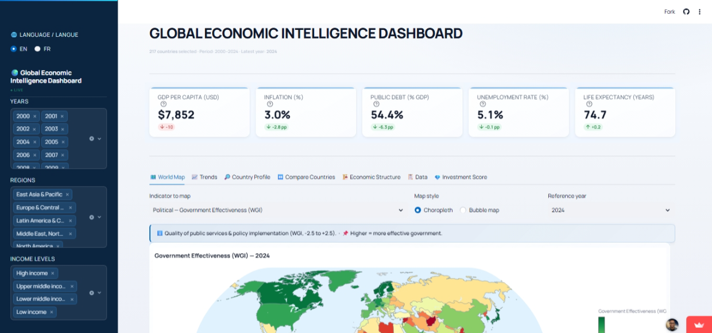

# 🌍 Global Economic Intelligence Dashboard

An interactive bilingual platform for exploring the macroeconomic and strategic environment of **217 countries**, from **2000 to 2024** — structured around the **PESTEL framework** and powered by **58 real World Bank indicators**.

<p align="left">
  
  
  
  
  
  
  
</p>

<p align="left">
  <a href="https://world-bi-dashboard.streamlit.app/">
    
  </a>
</p>

> 🇫🇷 **French version:** [README-fr.md](README-fr.md)

---

## Overview



## Why this dashboard?

Most freely available macroeconomic tools force you to choose between breadth (many countries, few indicators) and depth (rich analyses, one country at a time). This dashboard does both.

It combines **58 World Bank indicators** covering all PESTEL dimensions, data sourced directly from the official World Bank API, and a suite of visualizations designed for strategic analysis — all within a bilingual interface that is equally effective for quick country lookups and rigorous comparative studies. Everything is laid out across **seven coordinated views**, from the world map to a dedicated investment-intelligence module.

## Features

### 🗺️ World Map

- Switch between **choropleth maps** (color-coded countries) and **bubble maps** (proportional circles) for any of the 58 indicators.
- Percentile clipping for better contrast on skewed distributions.
- Regional median cards displayed directly beneath the map.

### 📈 Trends & Correlations

- Time series grouped by **region** or **income group** (2000–2024).
- Annotated vertical lines for major shocks — the **2008** financial crisis, **COVID-19 (2020)**, and the **2022** inflation surge (drawn when the year falls within the selected range).
- **OLS scatter plots** between any two indicators, with bubble sizes proportional to economic weight.
- Contextual info banners for each indicator, explaining what the metric means and how to interpret it.

### 🔎 Country Profile

The most comprehensive module. For each of the 217 countries:

- **Geographic map** with automatic zoom centered on the selected country, highlighted in its income group's color.
- **PESTEL radar** across 6 pillars — with inverse indicators (inflation, debt, unemployment, etc.) automatically inverted so the radar always reads "outward = better".
- **Dual-axis GDP vs. Inflation chart** — tracking economic output and price pressures on the same timeline.
- **100% stacked area chart** showing sectoral evolution (Agriculture / Industry / Services) over time.
- **Trade balance waterfall** — exports and imports side-by-side, with the net balance clearly displayed.
- **10-year normalized heatmap** — all available indicators from the last decade, min-max normalized (0–1) per column to highlight relative performance.
- **Sectoral donut chart** for the latest available year.
- **KPI cards** with year-on-year deltas, comparison to the world median, and dynamic natural-language interpretation (e.g., "HDI: very high", "above world median (unfavorable)").
- **Tooltips** on every KPI card showing the current value and the gap to the world median; the static bilingual **definition and reading tip** of each indicator are carried by the blue contextual banners instead.

### ↔️ Country Comparison

- Select up to **12 countries** simultaneously.
- Time-series line charts, ranking bar charts, and a summary table with year-on-year deltas.
- Works for any of the 58 available indicators.

### 🏗️ Economic Structure

- **Treemap** of sectoral composition (Agriculture / Industry / Services) by region and income group.
- **Violin plot** of GDP per capita distribution (log scale) — showing dispersion, concentrations, and outliers by income group.
- **Top 10 / Bottom 10 rankings** for any indicator.

### 📋 Data Explorer

- Fully navigable dataset with advanced filtering.
- Null-safe conditional formatting with semantically correct color gradients: green = better, red = worse (inverse indicators are handled automatically).
- **One-click CSV export** of any filtered view.

### 💎 Investment Score — Country Risk & Opportunity Screening

A decision-support module that turns the 58 indicators into a directly actionable read for market entry or portfolio allocation.

- **Composite attractiveness score (0–100)** built from 8 weighted indicators; choropleth map plus a region- and income-filterable **Top-10** leaderboard.
- **Risk / Return matrix**: 5-year GDP-per-capita CAGR (x-axis) against inflation volatility (y-axis), bubble size = GDP, four BCG-style quadrants (*Star / Question Mark / Cash Cow / Dog*).
- **Red-flag detector**: flags countries breaching standard risk thresholds, with 🔴 / 🟡 severity and *all / red / any* filters.
- **Clean-opportunity shortlist**: the Top-10 highest-scoring countries carrying **zero red flags**, with a Top-3 spotlight.

**How the score is built** — 8 weighted indicators, min-max normalized per year; inverse indicators are flipped so that *higher always means more attractive*:

| Weight | Indicator | Direction |
|---|---|---|
| 20% | GDP growth | higher = better |
| 20% | Political stability (WGI) | higher = better |
| 15% | Control of corruption (WGI) | higher = better |
| 15% | Inflation | inverse (lower = better) |
| 10% | Public debt (% GDP) | inverse |
| 10% | Trade openness | higher = better |
| 5% | Electricity access | higher = better |
| 5% | Internet users | higher = better |

**Risk thresholds** used by the red-flag detector:

| Signal | Threshold | Severity |
|---|---|---|
| Inflation | > 10% | 🔴 |
| Public debt | > 80% of GDP | 🔴 |
| Unemployment | > 15% | 🔴 |
| Political stability | < -1 (WGI) | 🔴 |
| Corruption perception | < 25 (CPI) | 🔴 |
| Inflation | 5–10% | 🟡 |
| Public debt | 50–80% of GDP | 🟡 |

## PESTEL Framework

The 58 indicators are organized into six strategic dimensions used in macroeconomic and competitive environment analysis.

| Pillar | # | Example Indicators |
|---|---|---|
| **Political** | 4 | Military expenditure (% GDP & % budget), Government Effectiveness (WGI), Political Stability (WGI) |
| **Economic** | 20 | GDP, GDP per capita (USD & PPP), Growth, Inflation, Public Debt, Trade Openness, FDI, Current Account, Remittances, FX Reserves, Sectoral value added |
| **Social** | 16 | Population, Life Expectancy, HDI, Gini Index, Unemployment, Youth Unemployment, Literacy, Infant Mortality, Fertility, Sanitation, Health & Education spending |
| **Technological** | 7 | R&D Expenditure, Researchers/million, High-tech exports, Internet users, Mobile & broadband subscriptions, Bank account ownership |
| **Environmental** | 4 | PM2.5 pollution, Electricity access, Power transmission losses, Cereal yield |
| **Legal & Governance** | 7 | Control of Corruption, Rule of Law, Regulatory Quality, Voice & Accountability (all WGI), CPI (Transparency Intl.), Transparency score, Women in parliament |

> **Inverse indicators** — where a higher value is unfavorable (inflation, debt, PM2.5, unemployment, etc.) — are handled automatically throughout the app: inverted in the PESTEL radar, colored with a "higher = worse" scale, and ranked in the correct direction.

## Project Structure

```text
world-economic-dashboard/
├── .streamlit/
│   └── config.toml                 # App theme and settings
├── assets/
│   └── style.css                   # Custom stylesheet
├── data/
│   ├── fetch_data.py               # World Bank API collection script
│   └── world_economic.csv          # Aggregated dataset (217 countries × 2000-2024)
├── .gitignore                      # Files to ignore in Git
├── app.py                          # Main Streamlit application
├── translations.py                 # EN/FR translation dictionary
├── requirements.txt                # Python dependencies
├── LICENSE                         # MIT license
├── README-en-us.md                 # This file, English documentation
└── README-fr.md                    # French documentation
```

## Data Sources

| Source | Coverage | Access |
|---|---|---|
| [World Bank — World Development Indicators (WDI)](https://databank.worldbank.org/source/world-development-indicators) | 56 indicators · 217 countries · 2000–2024 | Free REST API (`api.worldbank.org/v2`) |
| [Our World in Data — HDI](https://ourworldindata.org/human-development-index) | Human Development Index | Free CSV download (CC BY) |
| [Our World in Data — CPI](https://ourworldindata.org/corruption) | Corruption Perceptions Index | Free CSV download (CC BY) |

All data is open and freely accessible. World Bank data is used in accordance with the [World Bank Open Data Terms of Use](https://www.worldbank.org/en/about/legal/terms-of-use-for-datasets).

## Data Availability & Limitations

### Why is some data missing for certain countries?

1. **Variable national statistical capacities** — Developing countries may lack the resources or infrastructure needed for regular, standardized data collection, leading to irregular or missing reports.
2. **Creation and dissolution of countries** — Some countries simply did not exist before certain dates. South Sudan, for example, was created in 2011; data for prior years is structurally absent.
3. **Conflicts and political instability** — Wars, crises, and state fragility disrupt data collection and publication chains, sometimes for years.
4. **Publication delays** — International organizations typically take 12 to 18 months to validate, harmonize, and publish official data. The most recent calendar year is almost never fully covered.
5. **Indicator-specific coverage** — Some indicators only apply to subsets of countries: the CPIA transparency score, for instance, only applies to IDA-eligible countries; the Gini index is measured irregularly and with varying frequency across countries.
6. **Methodological differences** — Countries may use different calculation standards that are not directly comparable, leading to intentional exclusions during harmonization.

The dashboard displays all available data transparently. Missing cells render as "**—**" in tables and "**N/A**" on cards, with a neutral gray, non-semantic background, so gaps are never confused with low values.

### Why does the analysis period end in 2024?

1. **Data availability** — 2024 represents the most recent validated data published by the World Bank at the time of development.
2. **World Bank publication cycle** — Data is published with a 12 to 18-month lag. Complete indicator coverage for 2024 will not be available until late 2025 or 2026, depending on the metric.
3. **Consistency** — Setting 2024 as the end year ensures all 58 indicators have comparable, validated coverage, rather than mixing preliminary and final figures.
4. **Easy updating** — The `fetch_data.py` script can be rerun at any time.

> **Note:** A **Refresh from API** button is available in the dashboard sidebar. A single run updates all 58 indicators for all 217 countries in one pass.

## Use Cases

- **Business Intelligence** — Country risk scoring, market entry evaluation.
- **Investment intelligence** — Composite attractiveness scoring, risk/return quadrant mapping, and red-flag screening for market-entry and allocation decisions.
- **Strategic Planning** — PESTEL environmental analysis for any country or region.
- **Country Benchmarking** — Side-by-side comparison of up to 12 countries.
- **Academic Research** — 25 years of harmonized World Bank data, exportable to CSV.
- **Economic Intelligence** — Tracking macroeconomic trends in emerging markets.
- **Public Policy Analysis** — Monitoring governance, development, and sustainability indicators.
- **Education** — Interactive exploration of global economic data.

## Author

**Maxime NDACLEU** — Data Analyst & Business Intelligence Analyst

<p>
  <a href="https://github.com/maxin-dac"></a>
  <a href="https://www.linkedin.com/in/maximendacleu"></a>
</p>

---

## License

Distributed under the **MIT License** (see [LICENSE](LICENSE)).
Data provided by the **World Bank** (Open Data License) and **Our World in Data** (CC BY).
