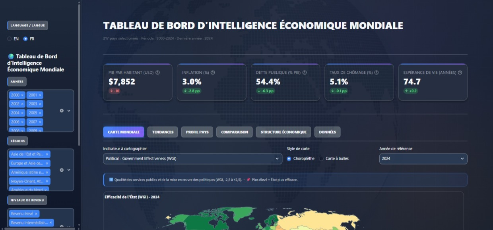
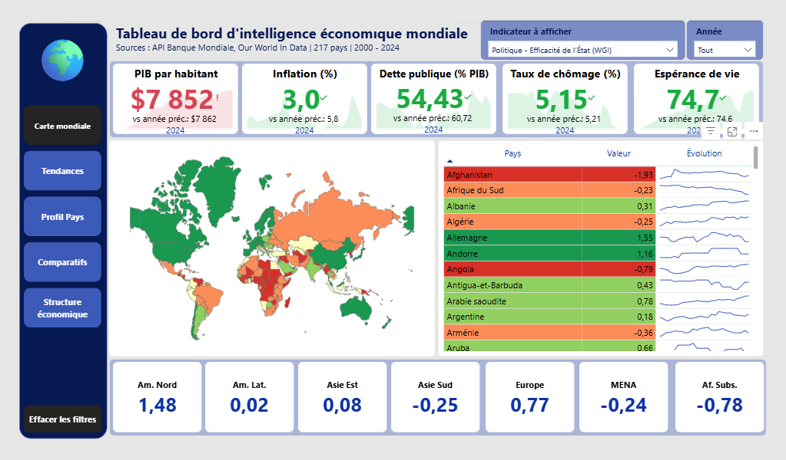

# 🌍 Tableau de Bord d'Intelligence Économique Mondiale

Plateforme bilingue intégrée (EN/FR) analysant les économies mondiales selon l'approche PESTEL. 217 pays · 2000-2024 · 58 indicateurs structurés de la Banque mondiale.

> **English documentation:** [README.md](README.md)

<p align="left">


</p>




## Table des matières

- [Fonctionnalités](#fonctionnalités)
- [Le jumeau Power BI](#le-jumeau-power-bi)
- [Couverture PESTEL](#couverture-pestel-58-indicateurs)
- [Architecture du Projet](#architecture-du-projet)
- [Démarrage rapide & Installation](#démarrage-rapide--installation)
  - [Option 1 : Live Demo](#option-1--live-demo)
  - [Option 2 : Installation Locale](#option-2--installation-locale)
  - [Option 3 : Déploiement avec Docker](#option-3--déploiement-avec-docker)
- [Documentation](#documentation)
  - [Guide utilisateur](#guide-utilisateur---interpréter-les-scores-et-les-vues)
  - [Documentation technique et API](#documentation-technique-et-api)
- [Problèmes connus & Dépannage](#problèmes-connus--dépannage)
- [Auteur](#auteur)
- [Licence](#licence)

## Fonctionnalités

**6 vues d'analyse spécialisés :**

- **Carte mondiale** - Choroplèthe + bulles, rognage par percentile, cartes de médiane régionale.
- **Tendances & corrélations** - Séries temporelles par région/revenu, lignes de chocs annotées (2008, 2020, 2022), scatter OLS.
- **Profil pays** - Radar PESTEL, heatmap normalisée 10 ans, double axe PIB/inflation, cascade balance commerciale.
- **Comparaison & Similarité pays** - Benchmarking multi-pays (jusqu'à 12 pays) et moteur de recherche de pays similaires.
- **Structure & Résilience économique** - Treemap sectoriel, violin plot log du PIB/hab., analyse de la résilience et des chocs.
- **Explorateur de données & Audit Qualité** - Jeu de données filtrable avec audit des données manquantes, mise en forme conditionnelle null-safe, export Excel (.xlsx) en un clic.

## Le jumeau Power BI

Un miroir Power BI complet du dashboard est maintenu en parallèle (en français uniquement).



| Élément | Chemin |
|---|---|
| Rapport | `data/powerbi/world-economic-dashboard.pbix` |
| Modèle (parquet) | généré par `scripts/prep_powerbi.py` |
| TopoJSON monde (choroplèthe) | `data/powerbi/world.topo.json` |

**Pages** : Carte mondiale (choroplèthe quintiles) · Tendances · Profil pays (drillthrough) · Comparatifs · Structure économique.

## Couverture PESTEL (58 indicateurs)

| Pilier | # | Exemples |
|---|---|---|
| Politique | 4 | Dépenses militaires, Efficacité gouvernementale, Stabilité politique (WGI) |
| Économique | 20 | PIB, PIB/hab., Croissance, Inflation, Dette publique, Ouverture commerciale, IDE, Compte courant |
| Social | 16 | Population, Espérance de vie, IDH, Gini, Chômage, Alphabétisation, Mortalité infantile |
| Technologique | 7 | R&D, Chercheurs, Exportations haute technologie, Utilisateurs internet, Abonnements mobiles |
| Environnemental | 4 | PM2,5, Accès électricité, Pertes en réseau, Rendement céréalier |
| Légal & Gouvernance | 7 | Contrôle de la corruption, État de droit, Qualité réglementaire, IPC, Score de transparence |

## Architecture du Projet

```
world-economic-dashboard/
├── .github/
│ ├── workflows/              # Pipelines CI/CD (lint, scan sécurité, refresh données)
│ └── dependabot.yml          # Mises à jour auto des dépendances (pip, GitHub Actions, Docker)
├── .streamlit/
│ └── config.toml             # Thème & paramètres UI Streamlit
├── assets/
│ ├── style.css               # Thème CSS bleu/navy sur-mesure
│ └── globe.png               # Filigrane globe (fond de l'app)
├── core/                     # Package Python modulaire principal
│ ├── constants.py            # Schémas PESTEL, palettes, indicateurs inversés
│ ├── data.py                 # Chargement des données (CSV + Parquet)
│ ├── indicators.py           # Métadonnées & interprétation des indicateurs
│ └── labels.py               # Résolution des libellés multilingues
├── data/
│ ├── fetch_data.py           # Pipeline de collecte API Banque Mondiale + OWID
│ ├── world_economic.csv      # Dataset agrégé (217 pays × 2000-2024)
│ └── world_economic.parquet  # Cache Parquet (chargement rapide)
├── docs/
│ └── screenshots/            # Captures d'aperçu du dashboard (FR + EN)
├── app.py                    # Point d'entrée Streamlit (7 onglets)
├── dataquality.py            # Module d'audit de qualité et de couverture
├── exports.py                # Moteur d'export Excel (.xlsx)
├── resilience.py             # Module d'analyse de résilience économique
├── similar.py                # Algorithme de similarité pays (PCA)
├── translations.py           # Dictionnaire de traduction bilingue (FR/EN)
├── Dockerfile                # Conteneur Docker de production
├── .dockerignore             # Optimisation du build Docker
├── requirements.txt          # Dépendances Python
├── SECURITY.md               # Politique de sécurité & signalement de vulnérabilités
├── LICENSE                   # Licence MIT
├── README.md                 # Documentation en anglais
└── README-fr.md              # Documentation en français
```

## Démarrage rapide & Installation

### Option 1 : Live Demo

- Cliquez sur le bouton ci-dessous pour utiliser le tableau de bord, hébergé sur **Streamlit Cloud**.

<p align="left">
<a href="https://world-bi-dashboard.streamlit.app/">

</a>
</p>

- Pour des besoins de redondance, l'application est également hébergée sur **Render**.

<p align="left">
  <a href="https://world-economic-dashboard.onrender.com/">
    
  </a>
</p>

### Option 2 : Installation Locale

1. **Cloner le dépôt :**

   ```bash
   git clone https://github.com/maxin-dac/world-economic-dashboard.git
   cd world-economic-dashboard
   ```

2. **Installer les dépendances :**

   ```bash
   pip install -r requirements.txt
   ```

3. **Lancer l'application Streamlit :**

   ```bash
   streamlit run app.py
   ```

### Option 3 : Déploiement avec Docker

1. **Construire l'image Docker :**

   ```bash
   docker build -t world-economic-dashboard .
   ```

2. **Lancer le conteneur :**

   ```bash
   docker run -p 8501:8501 world-economic-dashboard
   ```

3. Ouvrir `http://localhost:8501` dans votre navigateur web.

## Documentation

### Guide utilisateur

#### Réglages globaux

La barre latérale permet de choisir la langue de l'interface (anglais ou français), ainsi que les années, les régions et les niveaux de revenu à analyser. Ces filtres s'appliquent à l'ensemble des vues, et les médianes comme les classements sont recalculés à la volée sur la sélection retenue.

#### Radar PESTEL (Profil pays)

Chaque pilier reçoit une note de 0 à 100, égale à la médiane des indicateurs du pilier, normalisée en min-max par rapport au monde et corrigée des indicateurs inversés. Une note de **50** correspond donc à la position médiane mondiale ; au-delà de **70**, le pays figure dans le tiers supérieur ; en dessous de **30**, il se trouve en situation fragile. Plus que les valeurs absolues, comparez la **forme** des radars : les trois aires affichées représentent le pays, la médiane de sa région et la médiane mondiale.

#### Pays similaires

La similarité est calculée sur des indicateurs normalisés (structure sectorielle, PIB par habitant, variables macroéconomiques). Il s'agit d'un outil de **benchmarking de pairs**, et non d'une comparaison causale.

#### Explorateur de données et audit qualité

Dans l'explorateur, les dégradés par colonne indiquent si une valeur élevée est favorable (bleu) ou préoccupante (rouge/orangé pour les indicateurs inversés). L'audit qualité reporte la couverture globale, le nombre d'indicateurs complets à 95 % ou plus, le retard de fraîcheur et les anomalies statistiques.

#### Bonnes pratiques et limites

- Une corrélation n'implique pas de causalité (les droites OLS sont descriptives).
- **Tendance centrale** : médianes par défaut (robustes aux valeurs extrêmes : micro-États, hyperinflations). La moyenne n'est jamais utilisée pour les agrégats affichés ; la dispersion est mesurée par écart-type.
- 2024 est la dernière année validée (décalage de publication de 12 à 18 mois).
- Enfin, **les scores PESTEL sont relatifs** : 60/100 signifie « 60 % de l'écart min-max monde », et non une note absolue.

## Problèmes connus & dépannage

### Le message *« Failed to fetch dynamically imported module »* lors du lancement de l'application via Streamlit Cloud

Ce message peut apparaître immédiatement **après un redéploiement** (push ou reboot sur Streamlit Cloud). **Il ne s'agit pas d'un bug de l'application** : lors de chaque mise à jour, les fichiers JavaScript du frontend changent d'empreinte (hash). Un onglet resté ouvert - ou un cache navigateur périmé - référence encore les anciennes adresses et reçoit des erreurs, que chaque widget affiche dans son propre encadré rouge. Le serveur Python, lui, fonctionne normalement.

**Conduite à tenir :**

1. Actualiser la page web, ou utiliser le racourci clavier `Ctrl+Shift+R` (ou `Ctrl+F5`).
2. Si le message persiste, ouvrir l'application en navigation privée ou vider le cache du site.
3. Après un push, attendre 1 à 2 minutes la fin du déploiement avant de recharger la page.

Un visiteur qui arrive sur l'application une fois le déploiement terminé ne rencontre jamais ce message : c'est un simple artefact de rechargement post-mise à jour.

## Auteur

**Maxime NDACLEU** - Data Analyst & Business Intelligence Analyst

<p>
<a href="https://github.com/maxin-dac"></a>
<a href="https://www.linkedin.com/in/maximendacleu"></a>
</p>

## Licence

Distribué sous **licence MIT** (voir [LICENSE](LICENSE)).
Données fournies par la **Banque Mondiale** (licence Open Data) et **Our World in Data** (CC BY).
