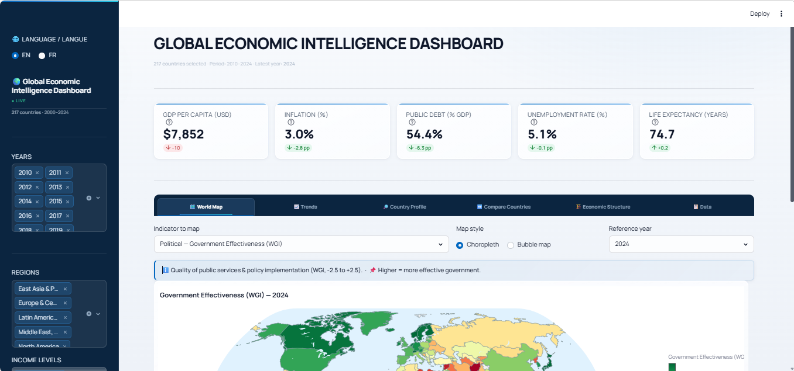

# 🌍 Tableau de Bord d'Intelligence Économique Mondiale

> **Problème** : les données macroéconomiques publiques sont dispersées, techniques et rarement présentées de manière comparable, pédagogique et stratégique.  
> **Solution** : une plateforme open source, bilingue et interactive qui agrège **58 indicateurs Banque Mondiale / Our World in Data** pour **217 pays (2000–2024)**, les structure selon le cadre **PESTEL**, et ajoute un module d'aide à la décision pour évaluer risque, attractivité et opportunités.

<p align="left">
  
  
  
  
  
  
  
  
  
  
  
  
  
</p>

<p align="left">
  <a href="https://world-bi-dashboard.streamlit.app/">
    
  </a>
</p>



🇬🇧 English version: [README.md](README.md)

---

## En bref

- **Ce que ça fait** : explorer, comparer et analyser 217 pays à partir d’indicateurs macroéconomiques, sociaux, technologiques, environnementaux et de gouvernance.
- **Compétences mobilisées** : data engineering, analyse exploratoire, statistiques, data visualisation, UX bilingue, dashboarding.
- **Démo** : [world-bi-dashboard.streamlit.app](https://world-bi-dashboard.streamlit.app/)
- **Stack** : Python · Streamlit · Plotly · Pandas · NumPy · Statsmodels · World Bank API

## Fonctionnalités principales

- 🗺️ **Carte mondiale** : choroplèthe ou bulles, avec médianes régionales.
- 📈 **Tendances & corrélations** : séries temporelles, scatter plots OLS, annotations des chocs 2008, 2020 et 2022.
- 🔎 **Profil pays** : radar PESTEL, PIB vs inflation, structure sectorielle, balance commerciale, heatmap 10 ans.
- ↔️ **Comparaison de pays** : jusqu'à 12 pays, courbes, classement et tableau de variation annuelle.
- 🏗️ **Structure économique** : treemap sectoriel, distribution du PIB/habitant, top 10 / bottom 10.
- 📋 **Explorateur de données** : filtres, mise en forme conditionnelle, export CSV.
- 💎 **Investment Score** : score d'attractivité, matrice risque/rendement, détection de signaux d'alerte et shortlist d'opportunités.

## Démarrage rapide

```bash
pip install -r requirements.txt
python data/fetch_data.py
streamlit run app.py
```

## Cadre PESTEL

| Pilier | Exemples d'indicateurs |
|---|---|
| Politique | Stabilité politique, efficacité gouvernementale, dépenses militaires |
| Économique | PIB, croissance, inflation, dette, commerce, IDE, réserves |
| Social | Population, santé, éducation, emploi, inégalités |
| Technologique | Internet, mobile, R&D, inclusion financière |
| Environnemental | Accès à l'électricité, pollution PM2.5, rendement agricole |
| Légal & gouvernance | Corruption, État de droit, qualité réglementaire, transparence |

## Investment Score

Module d'aide à la décision pour comparer rapidement les pays selon leur attractivité et leur niveau de risque.

<details>
<summary>Pondération du score</summary>

| Poids | Indicateur | Sens |
|---:|---|---|
| 20% | Croissance du PIB | Plus élevé = meilleur |
| 20% | Stabilité politique | Plus élevé = meilleur |
| 15% | Contrôle de la corruption | Plus élevé = meilleur |
| 15% | Inflation | Plus faible = meilleur |
| 10% | Dette publique | Plus faible = meilleur |
| 10% | Ouverture commerciale | Plus élevé = meilleur |
| 5% | Accès à l'électricité | Plus élevé = meilleur |
| 5% | Utilisateurs Internet | Plus élevé = meilleur |

</details>

<details>
<summary>Signaux d'alerte</summary>

| Signal | Seuil | Sévérité |
|---|---:|:---:|
| Inflation | > 10% | 🔴 |
| Dette publique | > 80% du PIB | 🔴 |
| Chômage | > 15% | 🔴 |
| Stabilité politique | < -1 | 🔴 |
| Perception de la corruption | < 25 | 🔴 |
| Inflation | 5–10% | 🟡 |
| Dette publique | 50–80% du PIB | 🟡 |

</details>

## Sources des données

| Source | Couverture | Accès |
|---|---|---|
| World Bank — WDI | 56 indicateurs, 217 pays, 2000–2024 | API publique |
| Our World in Data | IDH, Indice de perception de la corruption | CSV public |

## Limites

Le score d'investissement est un outil de **pré-criblage**, pas un indice économétrique définitif. Les pondérations sont des choix d'analyste et certaines données manquantes peuvent pénaliser les pays les plus fragiles.

<details>
<summary>Plus de détails</summary>

- Normalisation min-max sensible aux valeurs extrêmes.
- Redondance possible entre certains indicateurs de développement.
- Risque politique, de change et de défaut seulement partiellement capturés.
- Le TCAC sur 5 ans reflète une dynamique passée, pas un rendement futur garanti.

</details>

## Structure du projet

```text
world-economic-dashboard/
├── .streamlit/
│   └── config.toml
├── assets/
│   └── style.css
├── data/
│   ├── fetch_data.py
│   └── world_economic.csv
├── app.py
├── translations.py
├── requirements.txt
├── LICENSE
├── README.md
└── README-fr.md
```

---

## Auteur

**Maxime NDACLEU** — Data Analyst & Business Intelligence Analyst

<p align="left">
  <a href="https://github.com/maxin-dac">
    
  </a>
  <a href="https://www.linkedin.com/in/maximendacleu">
    
  </a>
</p>

---

## Licence

Projet distribué sous licence MIT. Données fournies par la Banque Mondiale et Our World in Data.