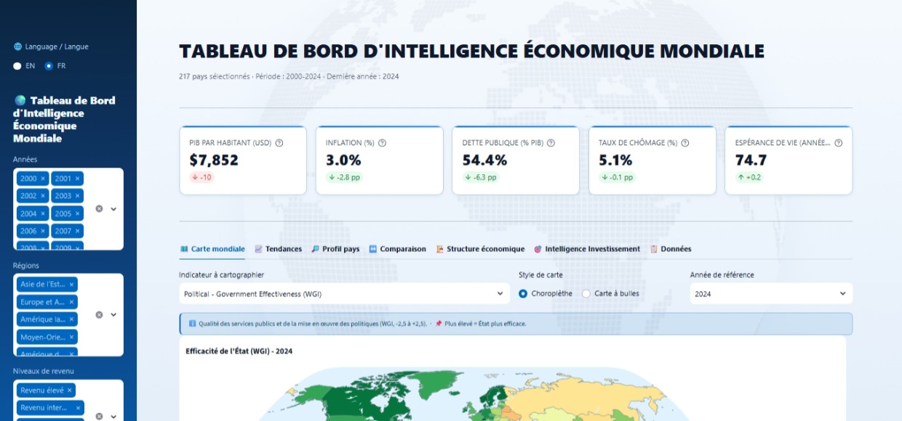

# 🌍 Tableau de Bord d'Intelligence Économique Mondiale

Plateforme interactive bilingue (FR/EN) - 217 pays · 2000-2024 · 58 indicateurs Banque Mondiale structurés selon le cadre **PESTEL**, complétés d'un module dédié **Intelligence Investissement**.

<p align="left">


</p>

<p align="left">
<a href="https://world-bi-dashboard.streamlit.app/">

</a>
</p>



> **Version anglaise :** [README.md](README.md)

## Table des matières

- [Fonctionnalités](#fonctionnalités)
- [Couverture PESTEL](#couverture-pestel-58-indicateurs)
- [Architecture du Projet](#architecture-du-projet)
- [Démarrage rapide & Installation](#démarrage-rapide--installation)
  - [Option 1 : Live Demo](#option-1--live-demo)
  - [Option 2 : Installation Locale](#option-2--installation-locale)
  - [Option 3 : Déploiement avec Docker](#option-3--déploiement-avec-docker)
- [Documentation](#documentation)
  - [Guide utilisateur](#guide-utilisateur---interpréter-les-scores-et-les-vues)
  - [Documentation technique et API](#documentation-technique-et-api)
- [Problèmes connus & Dépannage](#problèmes-connus--dépannage)
- [Auteur](#auteur)
- [Licence](#licence)

## Fonctionnalités

**7 vues coordonnées** + modules d'analyse spécialisés :

- **Carte mondiale** - Choroplèthe + bulles, rognage par percentile, cartes de médiane régionale.
- **Tendances & corrélations** - Séries temporelles par région/revenu, lignes de chocs annotées (2008, 2020, 2022), scatter OLS.
- **Profil pays** - Radar PESTEL, heatmap normalisée 10 ans, double axe PIB/inflation, cascade balance commerciale.
- **Comparaison & Similarité pays** - Benchmarking multi-pays (jusqu'à 12 pays) et moteur de recherche de pays similaires.
- **Structure & Résilience économique** - Treemap sectoriel, violin plot log du PIB/hab., analyse de la résilience et des chocs.
- **Explorateur de données & Audit Qualité** - Jeu de données filtrable avec audit des données manquantes, mise en forme conditionnelle null-safe, export Excel (.xlsx) en un clic.
- **Score Investissement** - Score composite 0-100 (8 indicateurs pondérés), matrice risque/rendement 4 quadrants, détecteur de signaux d'alerte, shortlist d'opportunités propres.

## Couverture PESTEL (58 indicateurs)

| Pilier | # | Exemples |
|---|---|---|
| Politique | 4 | Dépenses militaires, Efficacité gouvernementale, Stabilité politique (WGI) |
| Économique | 20 | PIB, PIB/hab., Croissance, Inflation, Dette publique, Ouverture commerciale, IDE, Compte courant |
| Social | 16 | Population, Espérance de vie, IDH, Gini, Chômage, Alphabétisation, Mortalité infantile |
| Technologique | 7 | R&D, Chercheurs, Exportations haute technologie, Utilisateurs internet, Abonnements mobiles |
| Environnemental | 4 | PM2,5, Accès électricité, Pertes en réseau, Rendement céréalier |
| Légal & Gouvernance | 7 | Contrôle de la corruption, État de droit, Qualité réglementaire, IPC, Score de transparence |

## Architecture du Projet

```
world-economic-dashboard/
├── .devcontainer/
│   └── devcontainer.json             # Conteneur de dev VS Code
├── .github/workflows/
│   ├── lint.yml                      # Pipeline CI de contrôle de qualité du code
│   └── update-data.yml               # Pipeline CI/CD mensuel d'actualisation des données
├── .streamlit/config.toml            # Configuration du thème Streamlit
├── assets/style.css                  # Thème CSS bleu/navy sur-mesure (filigrane globe)
├── core/                             # Package Python modulaire principal
│   ├── __init__.py
│   ├── analytics.py                  # Calculs statistiques et transformations
│   ├── constants.py                  # Définitions PESTEL, couleurs & schémas
│   ├── data.py                       # Chargement des données et optimisation mémoire
│   ├── indicators.py                 # Moteur de calcul des indicateurs
│   ├── investment.py                 # Algorithmes de scoring d'investissement et quadrants
│   └── labels.py                     # Résolution des libellés multilingues
├── data/
│   ├── fetch_data.py                 # Script de collecte API Banque Mondiale
│   ├── world_economic.csv            # Dataset agrégé (217 pays x 2000-2024)
│   └── world_economic.parquet        # Cache Parquet (chargement rapide)
├── screenshots/
│   └── aperçu.jpeg                   # Aperçu du tableau de bord (FR)
│   └── overview.jpeg                 # Aperçu du tableau de bord (EN)
├── scripts/
│   └── changelog_entry.py            # Aide à la génération du changelog
├── static/
│   └── globe.png                     # Filigrane globe (fond de l'app)
├── tests/
│   └── test_investment.py            # Suite de tests automatisés pytest
├── CHANGELOG.md                      # Historique des versions
├── app.py                            # Point d'entrée de l'application Streamlit
├── dataquality.py                    # Module d'audit de qualité des données et couverture
├── exports.py                        # Moteur d'export Excel (.xlsx)
├── resilience.py                     # Module d'analyse de résilience économique
├── similar.py                        # Moteur d'analyse de similarité entre pays
├── translations.py                   # Dictionnaire de traduction bilingue (FR/EN)
├── Dockerfile                        # Configuration de conteneurisation Docker
├── .dockerignore                     # Rôles d'exclusion pour le build Docker
├── requirements.txt                  # Dépendances Python
├── LICENSE                           # Licence MIT
├── README.md                         # Documentation en anglais
└── README-fr.md                      # French Documentation
```

## Démarrage rapide & Installation

### Option 1 : Live Demo

**Cliquez [ici](https://world-bi-dashboard.streamlit.app/) pour utiliser le tableau de bord, hébergé sur Streamlit Cloud**.

### Option 2 : Installation Locale

1. **Cloner le dépôt :**

   ```bash
   git clone https://github.com/maxin-dac/world-economic-dashboard.git
   cd world-economic-dashboard
   ```

2. **Installer les dépendances :**

   ```bash
   pip install -r requirements.txt
   ```

3. **Lancer l'application Streamlit :**

   ```bash
   streamlit run app.py
   ```

### Option 3 : Déploiement avec Docker

1. **Construire l'image Docker :**

   ```bash
   docker build -t world-economic-dashboard .
   ```

2. **Lancer le conteneur :**

   ```bash
   docker run -p 8501:8501 world-economic-dashboard
   ```

3. Ouvrir `http://localhost:8501` dans votre navigateur web.

## Documentation

### Guide utilisateur - Interpréter les scores et les vues

#### Réglages globaux

La barre latérale permet de choisir la langue de l'interface (anglais ou français), ainsi que les années, les régions et les niveaux de revenu à analyser. Ces filtres s'appliquent à l'ensemble des vues, et les médianes comme les classements sont recalculés à la volée sur la sélection retenue. En revanche, les scores normalisés (radar PESTEL et score d'investissement) restent toujours calculés par rapport au **monde entier** pour l'année choisie : un score conserve ainsi la même signification, quels que soient les filtres actifs.

#### Couleurs et valeurs manquantes

Chaque indicateur dispose de sa propre échelle de couleur. Pour les indicateurs dits **inversés** (inflation, dette publique, chômage, PM2.5, etc.), la valeur est retournée lors du calcul des scores : une valeur élevée compte alors comme un mauvais résultat. Les cartes sont rognées aux percentiles 2–98 afin que quelques valeurs extrêmes n'écrasent pas l'échelle de couleurs. Enfin, les cellules sans donnée apparaissent sous la forme « - » dans les tableaux et « N/A » sur les cartes KPI, sur un fond gris neutre.

#### Radar PESTEL (Profil pays)

Chaque pilier reçoit une note de 0 à 100, égale à la médiane des indicateurs du pilier, normalisée en min-max par rapport au monde et corrigée des indicateurs inversés. Une note de **50** correspond donc à la position médiane mondiale ; au-delà de **70**, le pays figure dans le tiers supérieur ; en dessous de **30**, il se trouve en situation fragile. Plus que les valeurs absolues, comparez la **forme** des radars : les trois aires affichées représentent le pays, la médiane de sa région et la médiane mondiale.

#### Score d'investissement (0-100)

Le score d'investissement agrège **huit indicateurs macroéconomiques pondérés** (PIB par habitant, croissance, inflation, dette publique, chômage, compte courant, investissements directs étrangers, ouverture commerciale), chacun normalisé par rapport au monde et retourné s'il est inversé. Au-delà de 70, le pays est jugé très attractif ; entre 50 et 70, il est intermédiaire ; sous 50, il est fragile. Cette lecture est relative au millésime mondial de l'année sélectionnée.

#### Matrice risque/rendement

L'axe horizontal représente le TCAM du PIB par habitant sur les cinq dernières années sélectionnées, l'axe vertical le risque (moyenne augmentée de l'écart-type de l'inflation), et la taille des bulles le PIB total. Les quadrants sont séparés par les médianes de l'échantillon et suivent la lecture classique : ⭐ Star, ❓ Question Mark, 💰 Cash Cow, ⚠️ Dog.

#### Red flags et opportunités

Un drapeau 🔴 signifie qu'un seuil critique est franchi (les règles sont définies dans `core/investment.py`) ; un drapeau 🟡 signale une zone de vigilance. La colonne `flag_details` détaille, pays par pays, les raisons de chaque drapeau. La shortlist des « meilleures opportunités » ne conserve que les pays **sans aucun red flag**, classés par score d'investissement.

#### Résilience et chocs

Le module résilience mesure la profondeur de la chute (drawdown) puis la vitesse de récupération après les chocs de 2008, 2020 et 2022. Un pays est jugé résilient lorsque la chute est limitée et que le niveau d'avant-choc est rapidement retrouvé.

#### Pays similaires

La similarité est calculée sur des indicateurs normalisés (structure sectorielle, PIB par habitant, variables macroéconomiques). Il s'agit d'un outil de **benchmarking de pairs**, et non d'une comparaison causale.

#### Explorateur de données et audit qualité

Dans l'explorateur, les dégradés par colonne indiquent si une valeur élevée est favorable (bleu) ou préoccupante (rouge/orangé pour les indicateurs inversés). L'audit qualité reporte la couverture globale, le nombre d'indicateurs complets à 95 % ou plus, le retard de fraîcheur et les anomalies statistiques.

#### Bonnes pratiques et limites

- Une corrélation n'implique pas de causalité (les droites OLS sont descriptives).
- Une médiane n'est pas une moyenne.
- 2024 est la dernière année validée (décalage de publication de 12 à 18 mois).
- Enfin, **les scores sont relatifs** : 60/100 signifie « 60 % de l'écart min-max monde », et non une note absolue.

### Documentation technique et API

#### Architecture de l'application

L'application est organisée en modules spécialisés :

- `app.py` est le point d'entrée Streamlit : il assemble les 7 onglets et gère les filtres globaux.
- `core/data.py` expose `load_data()`, qui charge le dataset (cache CSV + Parquet) et renvoie un `pd.DataFrame`.
- `core/constants.py` centralise les schémas PESTEL, les palettes de couleurs, la liste des indicateurs inversés (`INVERSE_INDICATORS`) et la fonction `get_expressive_colorscale()`.
- `core/indicators.py` fournit les métadonnées et l'interprétation des indicateurs (`indicator_info()`, `interpret_value()`, `show_indicator_info()`).
- `core/investment.py` contient les algorithmes de scoring (`compute_investment_score()`, `detect_red_flags()`, `compute_cagr()`).
- `core/analytics.py` regroupe des helpers statistiques mis en cache.
- `similar.py`, `resilience.py` et `dataquality.py` sont des modules autonomes exposant chacun une fonction `render(df_all, lang)`.
- `exports.py` génère le classeur Excel (`export_excel(df, year, lang) -> bytes`).
- `translations.py` assure la bilingualité via `t(key, lang, **fmt)`.

#### Pipeline de données

Le script `data/fetch_data.py` collecte les données de l'API Banque Mondiale et d'Our World in Data, puis les agrège dans `data/world_economic.csv` (217 pays × 2000–2024). Ce jeu de données est rafraîchi automatiquement chaque premier lundi du mois par le workflow `.github/workflows/update-data.yml`, qui enchaîne tests, collecte, génération du changelog, commit et redéploiement sur Streamlit Cloud.

#### API interne (fonctions indépendantes de l'interface)

```Py
    load_data() -> pd.DataFrame                     # country, iso3, region, income_group, year + 58 indicateurs
    compute_investment_score(df, year) -> DataFrame # + investment_score (0-100)
    detect_red_flags(df, year, lang) -> DataFrame   # + red_flags, yellow_flags, total_flags, flag_details
    compute_cagr(first, last, n) -> float           # taux de croissance annuel composé
    get_pestel_scores(df_target, df_world, year) -> dict  # {pilier: score 0-100}
    t(key, lang, **kwargs) -> str                   # traduction formatée
```

## Problèmes connus & dépannage

### Le message *« Failed to fetch dynamically imported module »* lors du lancement de l'application

Ce message peut apparaître immédiatement **après un redéploiement** (push ou reboot sur Streamlit Cloud). **Il ne s'agit pas d'un bug de l'application** : lors de chaque mise à jour, les fichiers JavaScript du frontend changent d'empreinte (hash). Un onglet resté ouvert - ou un cache navigateur périmé - référence encore les anciennes adresses et reçoit des erreurs, que chaque widget affiche dans son propre encadré rouge. Le serveur Python, lui, fonctionne normalement.

**Conduite à tenir :**

1. Actualiser la page web, ou utiliser le racourci clavier `Ctrl+Shift+R` (ou `Ctrl+F5`).
2. Si le message persiste, ouvrir l'application en navigation privée ou vider le cache du site.
3. Après un push, attendre 1 à 2 minutes la fin du déploiement avant de recharger la page.

Un visiteur qui arrive sur l'application une fois le déploiement terminé ne rencontre jamais ce message : c'est un simple artefact de rechargement post-mise à jour.

## Auteur

**Maxime NDACLEU** - Data Analyst & Business Intelligence Analyst

<p>
<a href="https://github.com/maxin-dac"></a>
<a href="https://www.linkedin.com/in/maximendacleu"></a>
</p>

## Licence

Distribué sous **licence MIT** (voir [LICENSE](LICENSE)).
Données fournies par la **Banque Mondiale** (licence Open Data) et **Our World in Data** (CC BY).
