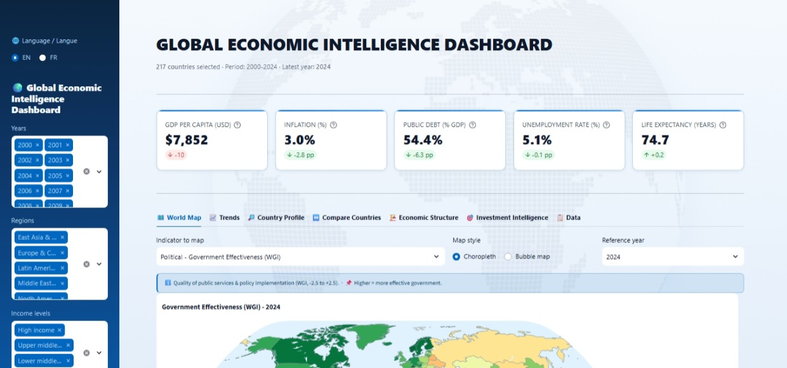

# 🌍 Global Economic Intelligence Dashboard

Interactive bilingual platform (EN/FR) - 217 countries · 2000-2024 · 58 World Bank indicators structured around the **PESTEL** framework, plus a dedicated **Investment Intelligence** module.

<p align="left">


</p>

<p align="left">
<a href="https://world-bi-dashboard.streamlit.app/">

</a>
</p>



> **French version:** [README-fr.md](README-fr.md)

## Table of Contents

- [Features](#features)
- [PESTEL Coverage](#pestel-coverage-58-indicators)
- [Project Architecture](#project-architecture)
- [Quick Start & Installation](#quick-start--installation)
  - [Option 1: Live Demo](#option-1-live-demo)
  - [Option 2: Local Setup](#option-2-local-setup)
  - [Option 3: Docker Setup](#option-3-docker-setup)
- [Documentation](#documentation)
  - [User guide](#user-guide---interpreting-the-scores-and-views)
  - [Technical & API documentation](#technical--api-documentation)
- [Known issues & troubleshooting](#known-issues--troubleshooting)
- [Author](#author)
- [License](#license)

## Features

**7 coordinated views** + specialized analytical modules:

- **World Map** - Choropleth + bubble maps, percentile clipping, regional median cards.
- **Trends & Correlations** - Time series by region/income, annotated shock lines (2008, 2020, 2022), OLS scatter plots.
- **Country Profile** - PESTEL radar, 10-year normalized heatmap, dual-axis GDP/inflation, trade balance waterfall.
- **Country Comparison & Similarity** - Multi-country benchmarking (up to 12 countries) and peer similarity matching engine.
- **Economic Structure & Resilience** - Sectoral treemap, log-scale violin plot of GDP/capita, resilience & shock analysis.
- **Data Explorer & Quality Audit** - Filterable dataset with missingness audit, null-safe conditional formatting, one-click Excel (.xlsx) export.
- **Investment Score** - Composite 0-100 attractiveness score (8 weighted indicators), risk/return 4-quadrant matrix, red-flag detector, clean-opportunity shortlist.

## PESTEL Coverage (58 indicators)

| Pillar | # | Examples |
| --- | --- | --- |
| Political | 4 | Military expenditure, Government Effectiveness, Political Stability (WGI) |
| Economic | 20 | GDP, GDP/capita, Growth, Inflation, Public Debt, Trade Openness, FDI, Current Account |
| Social | 16 | Population, Life Expectancy, HDI, Gini, Unemployment, Literacy, Infant Mortality |
| Technological | 7 | R&D, Researchers, High-tech exports, Internet users, Mobile subscriptions |
| Environmental | 4 | PM2.5, Electricity access, Power losses, Cereal yield |
| Legal & Governance | 7 | Corruption Control, Rule of Law, Regulatory Quality, CPI, Transparency score |

## Project Architecture

```
world-economic-dashboard/
├── .devcontainer/
│   └── devcontainer.json             # VS Code dev container
├── .github/workflows/
│   ├── lint.yml                      # CI code quality & syntax validation
│   └── update-data.yml               # Monthly automated data refresh pipeline
├── .streamlit/config.toml            # Streamlit theme & UI settings
├── assets/style.css                  # Custom blue/navy theme CSS (globe watermark)
├── core/                             # Core modular python package
│   ├── __init__.py
│   ├── analytics.py                  # Statistical analytics & data transformations
│   ├── constants.py                  # PESTEL definitions, colors & indicator schemas
│   ├── data.py                       # Cached data loading & optimization
│   ├── indicators.py                 # Indicator calculation engines
│   ├── investment.py                 # Investment scoring & quadrant algorithms
│   └── labels.py                     # Multilingual label resolvers
├── data/
│   ├── fetch_data.py                 # World Bank API data ingestion pipeline
│   ├── world_economic.csv            # Aggregated dataset (217 countries x 2000-2024)
│   └── world_economic.parquet        # Parquet cache for fast local loading
|── screenshots/
|   ├── aperçu.jpeg                   # Dashboard overview (FR)
|   └── overview.jpeg                 # Dashboard overview (FR)
├── scripts/
│   └── changelog_entry.py            # Changelog generation helper
├── static/
│   └── globe.png                     # Globe watermark (app background)
├── tests/
│   └── test_investment.py            # Pytest automated test suite
├── CHANGELOG.md                      # Release history
├── app.py                            # Streamlit entry point application
├── dataquality.py                    # Data quality auditing & coverage reporting
├── exports.py                        # Excel (.xlsx) export engine
├── resilience.py                     # Economic resilience & vulnerability module
├── similar.py                        # Country similarity algorithm engine
├── translations.py                   # Multilingual (EN/FR) translation matrix
├── Dockerfile                        # Production Docker container configuration
├── .dockerignore                     # Docker build optimization rules
├── requirements.txt                  # Python dependencies
├── LICENSE                           # MIT License
├── README.md                         # English Documentation
└── README-fr.md                      # French Documentation
```

## Quick Start & Installation

### Option 1: Live Demo

**Click [here](https://world-bi-dashboard.streamlit.app/) to use the dashboard, hosted on Streamlit Cloud**.

### Option 2: Local Setup

1. **Clone the repository:**

   ```bash
   git clone https://github.com/maxin-dac/world-economic-dashboard.git
   cd world-economic-dashboard
   ```

2. **Install dependencies:**

   ```bash
   pip install -r requirements.txt
   ```

3. **Run the Streamlit application:**

   ```bash
   streamlit run app.py
   ```

### Option 3: Docker Setup

1. **Build the Docker image:**

   ```bash
   docker build -t world-economic-dashboard .
   ```

2. **Run the container:**

   ```bash
   docker run -p 8501:8501 world-economic-dashboard
   ```

3. Open `http://localhost:8501` in your web browser.

## Documentation

### User guide - Interpreting the scores and views

#### Global settings

The sidebar lets you choose the interface language (English or French), together with the years, regions and income levels to analyse. These filters apply to every view, and medians as well as rankings are recomputed on the fly over the selected subset. Normalized scores (PESTEL radar and investment score), however, are always computed against the **whole world** for the chosen year, so that a score keeps the same meaning regardless of the active filters.

#### Colors and missing values

Each indicator has its own color scale. For **inverse indicators** (inflation, public debt, unemployment, PM2.5, etc.), the value is flipped when scores are computed: a high value then counts as a poor result. Maps are clipped at the 2nd–98th percentiles so that a few extreme values cannot crush the color scale. Missing cells appear as "-" in tables and "N/A" on KPI cards, on a neutral gray background.

#### PESTEL radar (Country profile)

Each pillar receives a 0-100 score equal to the median of the pillar's indicators, min-max normalized against the world and corrected for inverse indicators. A score of **50** therefore corresponds to the world median position; above **70** the country sits in the top tier; below **30** it is in a fragile situation. Compare the **shapes** of the radars rather than absolute values: the three displayed areas represent the country, its regional median and the world median.

#### Investment score (0-100)

The investment score aggregates **eight weighted macroeconomic indicators** (GDP per capita, growth, inflation, public debt, unemployment, current account, foreign direct investment, trade openness), each normalized against the world and flipped when inverse. Above 70 the country is considered very attractive; between 50 and 70 it is intermediate; below 50 it is fragile. This reading is relative to the world vintage of the selected year.

#### Risk/return matrix

The horizontal axis shows GDP-per-capita CAGR over the last five selected years, the vertical axis the risk (inflation mean plus standard deviation), and the bubble size the total GDP. Quadrants are split at the sample medians and follow the classic reading: ⭐ Star, ❓ Question Mark, 💰 Cash Cow, ⚠️ Dog.

#### Red flags and opportunities

A 🔴 flag means a critical threshold has been breached (the rules live in `core/investment.py`); a 🟡 flag signals a watch zone. The `flag_details` column lists, country by country, the reasons behind each flag. The "top opportunities" shortlist keeps only countries with **no red flag at all**, ranked by investment score.

#### Resilience and shocks

The resilience module measures the depth of the drop (drawdown) and the speed of recovery after the 2008, 2020 and 2022 shocks. A country is deemed resilient when the drop is limited and the pre-shock level is quickly regained.

#### Similar countries

Similarity is computed over normalized indicators (sector structure, GDP per capita, macroeconomic variables). It is a **peer-benchmarking** tool, not a causal comparison.

#### Data explorer and quality audit

In the explorer, per-column gradients show whether a high value is favorable (blue) or concerning (red/orange for inverse indicators). The quality audit reports overall coverage, the number of indicators at least 95% complete, the freshness lag and the statistical anomalies.

#### Best practices and limitations

- Correlation does not imply causation (OLS trendlines are descriptive).
- A median is not a mean.
- 2024 is the latest validated year (12–18 month publication lag).
- Finally, **scores are relative**: 60/100 means "60% of the world min-max gap", not an absolute grade.

### Technical & API documentation

#### Application architecture

The application is organized into specialized modules:

- `app.py` is the Streamlit entry point: it assembles the 7 tabs and manages the global filters.

- `core/data.py` exposes `load_data()`, which loads the dataset (CSV + Parquet cache) and returns a `pd.DataFrame`.
- `core/constants.py` centralizes the PESTEL schemas, color palettes, the list of inverse indicators (`INVERSE_INDICATORS`) and the `get_expressive_colorscale()` function.
- `core/indicators.py` provides indicator metadata and interpretation (`indicator_info()`, `interpret_value()`, `show_indicator_info()`).
- `core/investment.py` contains the scoring algorithms (`compute_investment_score()`, `detect_red_flags()`, `compute_cagr()`).
- `core/analytics.py` groups cached statistical helpers.
- `similar.py`, `resilience.py` and `dataquality.py` are standalone modules, each exposing a `render(df_all, lang)` function.
- `exports.py` generates the Excel workbook (`export_excel(df, year, lang) -> bytes`).
- `translations.py` handles bilingualism through `t(key, lang, **fmt)`.

#### Data pipeline

The `data/fetch_data.py` script collects data from the World Bank API and Our World in Data, then aggregates them into `data/world_economic.csv` (217 countries × 2000–2024). This dataset is automatically refreshed on the first Monday of every month by the `.github/workflows/update-data.yml` workflow, which chains tests, data fetch, changelog generation, commit and Streamlit Cloud redeployment.

#### Internal API (UI-independent functions)

```Py
    load_data() -> pd.DataFrame                     # country, iso3, region, income_group, year + 58 indicators
    compute_investment_score(df, year) -> DataFrame # + investment_score (0-100)
    detect_red_flags(df, year, lang) -> DataFrame   # + red_flags, yellow_flags, total_flags, flag_details
    compute_cagr(first, last, n) -> float           # compound annual growth rate
    get_pestel_scores(df_target, df_world, year) -> dict  # {pillar: 0-100 score}
    t(key, lang, **kwargs) -> str                   # formatted translation
```

## Known issues & troubleshooting

### The *"Failed to fetch dynamically imported module"* when launching the app

This message may appear immediately **after a redeployment** (push or reboot on Streamlit Cloud). **It is not an application bug**: on every update, the frontend JavaScript files change their fingerprint (hash). A tab left open - or a stale browser cache - still references the old addresses and receives errors, which each widget displays in its own red box. The Python server, meanwhile, runs normally.

**What to do:**

1. Refresh the page, or use the keyboard shortcut `Ctrl+Shift+R` (or `Ctrl+F5`).
2. If the message persists, open the app in private browsing or clear the site data (DevTools → Application → Clear site data).
3. After a push, wait 1–2 minutes for the deployment to finish before reloading the page.

A visitor arriving once the deployment is complete never encounters this message: it is merely a post-update reload artifact.

## Author

**Maxime NDACLEU** - Data Analyst & Business Intelligence Analyst

<p>
<a href="https://github.com/maxin-dac"></a>
<a href="https://www.linkedin.com/in/maximendacleu"></a>
</p>

## License

Distributed under the **MIT License** (see [LICENSE](LICENSE)).
Data provided by the **World Bank** (Open Data License) and **Our World in Data** (CC BY).
